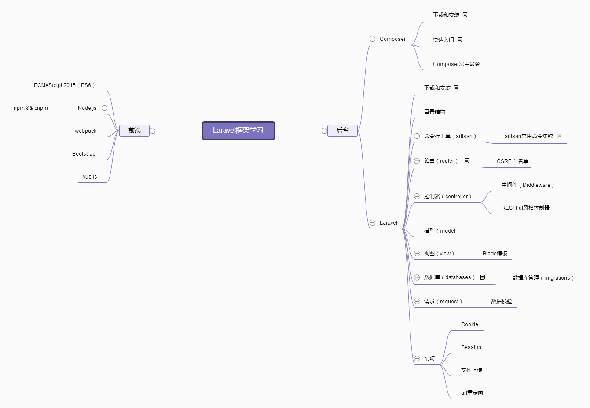

# lavaverl 框架
> Love beautiful code? We do too.     
The PHP Framework For Web Artisans

先来个大纲

## Composer

1. [Composer安装](composer/install.md)
2. [Composer快速入门](composer/get_start.md)
3. [Composer常用包和命令](composer/packagelist.md)

## Laravel

1. [下载和安装](laravel/install_dir.md)
2. [目录结构](laravel/install_dir.md#_2)
3. [命令行（artisan）](laravel/artisan.md)
4. [路由（router）](laravel/route.md)
5. [控制器（controller）](laravel/controller.md)
6. [中间件（middleware）](laravel/middleware.md)

### 模型（model）

### 视图（view）

### 请求（request）

## Composer

<!--Note-->
### 简介
> 包管理器

<!--/Note-->

### 下载和安装

## Vue
