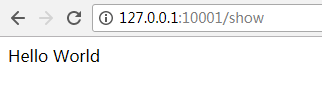
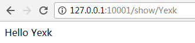

## route 基本路由

构建最基本的路由只需要一个 URI 与一个 闭包，这里提供了一个非常简单优雅的定义路由的方法：
```php
Route::get('test', function () {
    return 'Hello World';
});
```
还可以定义一些路由参数：
```
Route::get('posts/{post}/comments/{comment}', function ($postId, $commentId) {
    // return $postId . $commentId;
});
```
`注意：路由参数不能包含 - 字符。请用下划线 (_) 替换。`   


## 可用的路由方法#
```PHP
Route::get($uri, $callback);
Route::post($uri, $callback);
Route::put($uri, $callback);
Route::patch($uri, $callback);
Route::delete($uri, $callback);
Route::options($uri, $callback);
```

有的时候你可能需要注册一个可响应多个 HTTP 方法的路由，这时你可以使用 `match` 方法，也可以使用 `any` 方法注册一个实现响应所有 HTTP 的请求的路由：

```
Route::match(['get', 'post'], '/', function () {
    //
});

Route::any('foo', function () {
    //
});
```

**例如：**   
在`web.php`里面配置了如下路由：
```php
Route::get('show',function(){
	return 'Hello World';
});
```
结果：



## 命名路由
命名路由可以方便的生成 `URL` 或者重定向到指定的路由，你可以在定义路由后使用 `name` 方法实现：
```php
Route::get('user/profile', function () {
    //
})->name('profile');
// 或者
Route::get('user/profile', 'UserController@showProfile')->name('profile');
```
页面生成url方法实现：
```php
// 生成 URL...
$url = route('profile');

// 生成重定向...
return redirect()->route('profile');
```


## 路由参数#

### 必选路由参数#
当然，有时我们需要在路由中捕获一些 URL 片段。例如，我们需要从 URL 中捕获用户的 ID ，我们可以这样定义路由参数：
```php
Route::get('user/{id}', function ($id) {
    return 'User '.$id;
});
```
也可以根据需要在路由中定义多个参数：
```php
Route::get('posts/{post}/comments/{comment}', function ($postId, $commentId) {
    //
});
```
路由的参数通常都会被放在 {} 内，并且参数名只能为字母，当运行路由时，参数会通过路由闭包来传递。

`注意： 路由参数不能包含 - 字符。请用下划线 (_) 替换。`

### 可选路由参数#
声明路由参数时，如需指定该参数为可选，可以在参数后面加上 ? 来实现，但是相应的变量必须有默认值：
```php
Route::get('user/{name?}', function ($name = null) {
    return $name;
});

Route::get('user/{name?}', function ($name = 'John') {
    return $name;
});
```

### 正则表达式约束#
你可以使用 where 方法来规范你的路由参数格式。`where` 方法接受参数名称和定义参数约束规则的正则表达式：
```php
	
Route::get('user/{name}', function ($name) {
    //
})->where('name', '[A-Za-z]+');

Route::get('user/{id}', function ($id) {
    //
})->where('id', '[0-9]+');

Route::get('user/{id}/{name}', function ($id, $name) {
    //
})->where(['id' => '[0-9]+', 'name' => '[a-z]+']);
```

### 全局约束#

如果你希望路由参数在全局范围内都遵循一个确定的正则表达式约束，则可以使用 `pattern` 方法。你应该在 `RouteServiceProvider` 的 `boot` 方法里定义这些模式：
```php	
/**
 * 定义你的路由模型绑定, pattern 过滤器等。
 *
 * @return void
 */
public function boot()
{
    Route::pattern('id', '[0-9]+');

    parent::boot();
}
	
```
`Pattern` 一旦被定义，便会自动应用到所有使用该参数名称的路由上：

```php
Route::get('user/{id}', function ($id) {
    // 仅在 {id} 为数字时执行...
});
```

**例如：**  
在`web.php`里面配置了如下路由：
```php
Route::get('show/{name}',function($name){
	return 'Hello ' . $name;
});
```
结果：  


## 控制器路由绑定
语法：
```php
// 方法绑定。
Route::get(路径,命名空间\控制器@方法);	
// 例如：
Route::get('blog','BlogController@index');
//绑定了Blog控制器的index方法到blog
```
详细方法到控制器绑定方法请移步到 : [控制器路由绑定](controller.md)

## 跨站请求伪造 ( CSRF )
> Laravel 提供了简单的方法使你的应用免受 跨站请求伪造 (CSRF) 的袭击。跨站请求伪造是一种恶意的攻击，它凭借已通过身份验证的用户身份来运行未经过授权的命令。

功能实现：   
任何情况下在你的应用程序中定义 HTML 表单时都应该包含 CSRF 令牌隐藏域，这样 CSRF 保护中间件才可以验证请求。辅助函数 `csrf_field` 可以用来生成令牌字段：
```html
<form method="POST" action="/profile">
    {{ csrf_field() }}
    ...
</form>
```
包含在 `web` 中间件组里的 `VerifyCsrfToken` 中间件会自动验证请求里的令牌 `token` 与 `Session` 中存储的令牌 `token` 是否匹配。

> 该功能可以简单的理解为生活中的钥匙（Token），我们访问这个房子（网站）的时候就要带上这个钥匙。否则就不让你进去。